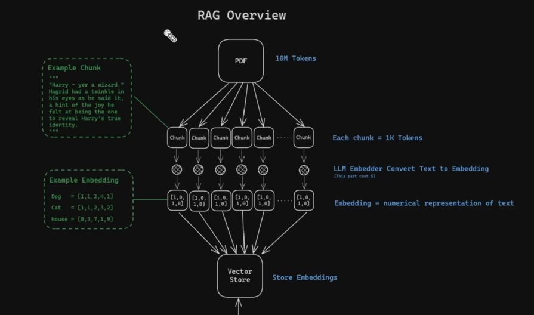
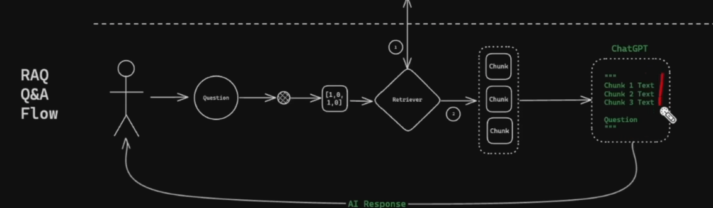

MMR for diversifying the results when retrieving


Flow of `7_rag_conversational.py`
```
User types query
   |
   v
+---------------------------+
| Inputs:                   |
| - input (user question)   |
| - chat_history            |
+---------------------------+
   |
   v
(1) History-aware retriever
   |
   |--> (1a) LLM rewrites question using history
   |        "How does it store it?"
   |        -> "How does Chroma store vectors and metadata?"
   |
   |--> (1b) Retriever searches Chroma using rewritten question
   |        -> returns top k=3 chunks
   v
(2) Stuff documents into {context}
   |
   v
(3) QA LLM answers using prompt:
    System: instructions + {context}
    History: chat_history
    Human: {input}
   |
   v
Return result["answer"]
   |
   v
Append messages to chat_history
```