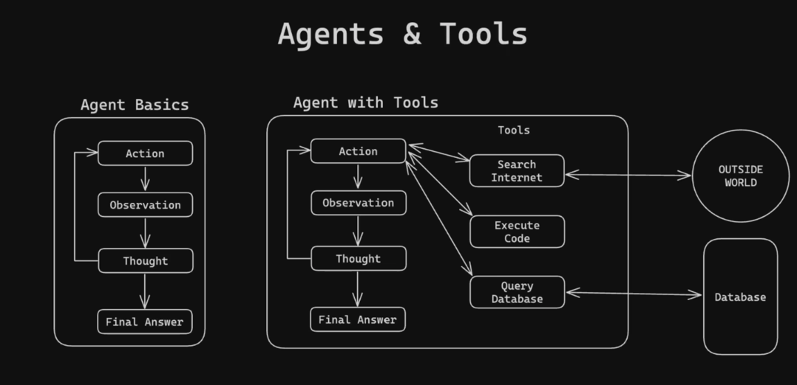

```
User question
   ↓
Prompt lists tools + rules
   ↓
LLM outputs:
   Action: current_time
   Action Input: ""
   ↓
LangChain detects Action
   ↓
LangChain calls Python function
   ↓
Tool returns result
   ↓
LangChain adds:
   Observation: <result>
   ↓
LLM sees Observation
   ↓
LLM outputs Final Answer
```